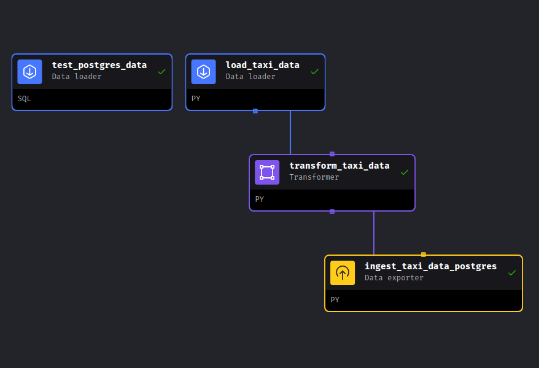
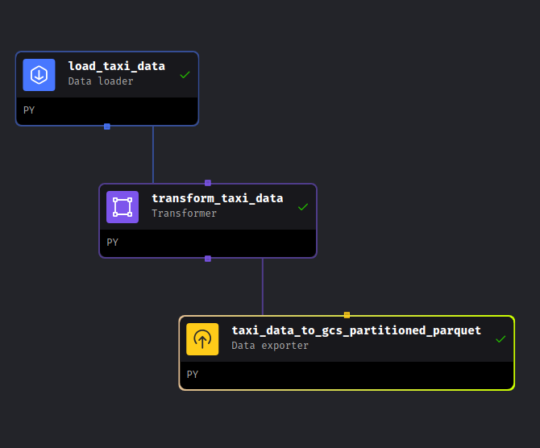
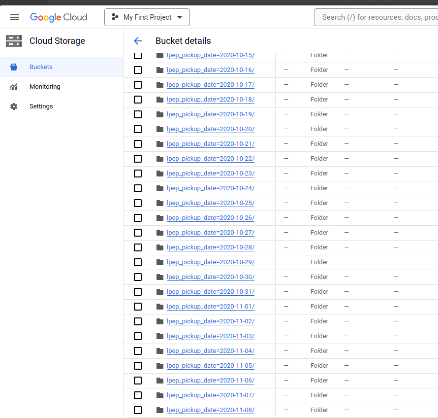

# Data Engineering Zoomcamp - Week 2 Homework: 02-workflow-orchestration

We will use tool called Mage - an open-source, hybrid framework for transforming and integrating data - to Build ETL pipelines.

## Let's get started
```
cd mage-homework
```
Create `.env` file with your parameters — this will _ensure_ the file is not committed to Git by accident, since it _will_ contain credentials in the future.
```
PROJECT_NAME=mage-homework
POSTGRES_DBNAME=postgres
POSTGRES_SCHEMA=green
POSTGRES_USER=postgres
POSTGRES_PASSWORD=postgres
POSTGRES_HOST=postgres
POSTGRES_PORT=5432
```

Now, let's build the container

```bash
docker compose build
```

Finally, start the Docker container:

```bash
docker compose up -d
```

Now, navigate to http://localhost:6789 in your browser to get started. 

### What just happened?

We just initialized a new mage repository. It will be present in your project under the name `mage-homework`. If you changed the varable `PROJECT_NAME` in the `.env` file, it will be named whatever you set it to.

## Create Pipelines aka DAGs

**Note**: Code for each block is available in respective load, transform and export .py files

1. `green_taxi_etl` : For data ingestion to local postgress db


2. `green_taxi_etl_gcs_partitioned` :  For data ingestion to gcs partioned by lpep_pickup_date


### Data in gcs bucket

- partioned by lpep_pickup_date

